# Manimbot - AI-Powered Manim Animation Generator

Generate beautiful Manim animations using AI. Describe what you want to animate, and the system generates the code and renders it.

## Demo


### Current state with Integrals


## Architecture



## Quick Start (30 Seconds)

### 1. Install Dependencies
```bash
pip install -r requirements.txt
```

### 2. Set Up API Key
```bash
cp .env.example .env
# Edit .env and add your TogetherAI API key
```

### 3. Run
```bash
python main.py
```

### 4. Describe Your Animation
```
Your request: a blue circle growing and rotating
```

Done! Your animation renders automatically.

## Detailed Setup Guide


### Prerequisites

Make sure you have:
- Python 3.10+
- Manim installed and working
- FFmpeg (for video rendering)

### Step-by-Step Setup

#### 1. Clone/Download the Project
```bash
cd ManimAiGen
```

#### 2. Install Dependencies
```bash
pip install -r requirements.txt
```

#### 3. Configure API Key

1. Get a TogetherAI API key from [together.ai](https://www.together.ai/)

2. Create a `.env` file in the project root:
```bash
cp .env.example .env
```

3. Edit `.env` and add your API key:
```
TOGETHER_API_KEY=your_actual_api_key_here
```

## Usage

### Basic Usage

```bash
python main.py
```

Then enter your animation description when prompted:

```
Your request: a blue circle that grows larger and rotates 360 degrees while changing to red
```

### Output

Generated scenes are saved in the `generated_scenes/` directory with the scene class name as the filename.

## Examples

### Example 1: Simple Shape Animation
```
Request: Create a green square that morphs into a purple circle with a smooth animation
```

### Example 2: Mathematical Visualization
```
Request: Visualize a sine wave with animated points moving along the curve
```

### Example 3: Multiple Objects
```
Request: Show three bouncing balls of different colors interacting with each other
```

## Tips for Better Results

1. **Be Specific**: Describe exact movements, colors, and timing
2. **Use Examples**: The system learns from examples when generating code
3. **Start Simple**: Test with basic animations first
4. **Review Code**: Check generated code in `generated_scenes/` directory
5. **Iterate**: Refine your requests based on results

## Generating Higher Quality Videos

After testing with low quality, you can render in high quality:

1. Find your generated scene in `generated_scenes/`
2. Render with higher quality:

```bash
manim -qh generated_scenes/your_scene.py YourSceneClassName
```

## Troubleshooting

### API Key Error
```
Error: TOGETHER_API_KEY environment variable not set
```
**Solution:** Make sure your `.env` file exists and contains the API key

### Manim Not Found
```
Error: Manim rendering failed
```
**Solution:** Install Manim and verify it works: `manim --version`

### Rendering Timeout
**Solution:** The scene may be too complex. Simplify or render at a lower quality

### Memory Issues
**Solution:** Reduce quality level or break complex animations into multiple scenes

## Next Steps

- Explore the `examples/` directory for animation patterns
- Modify generated code to fine-tune results
- Create complex animations by combining multiple scenes
- Build animations in the `examples/` directory for training context

## License

MIT

## Support

For issues with:
- **Manim**: [Manim Documentation](https://docs.manim.community/)
- **TogetherAI**: [Together AI Support](https://together.ai/)
- **This Project**: Check the README or create an issue
